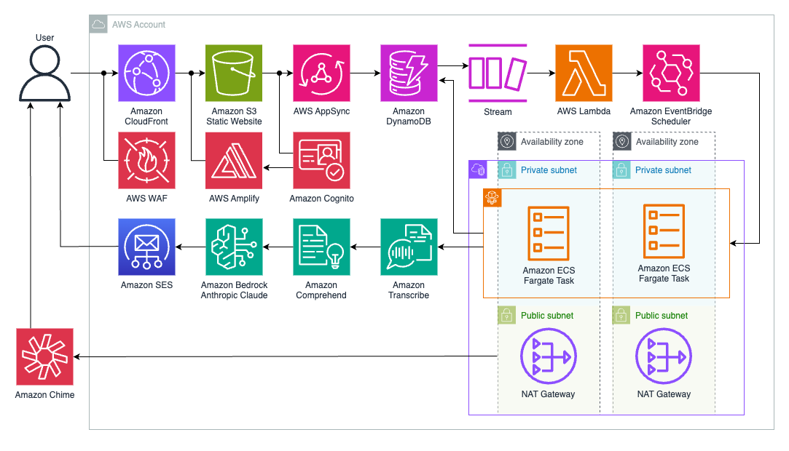

# Automated Meeting Scribe and Summarizer

Using this application's website, you can invite an AI-assisted scribe to your upcoming Amazon Chime or Webex meeting(s) to get a follow-up email with the speaker list, chat history, attachments, and transcript, as well as a summary and action items. You do not even need to be present in a meeting for an invited scribe to join. Each scribe is linked to your email for identification. The scribe redacts sensitive personally identifiable information (PII) by default. And, all processing, from transcription to summarization, is done within the AWS account that the CDK is deployed to.

## Architecture

### Application Resources
- The static website is hosted in Amazon S3 and served using Amazon CloudFront.
- Web authentication is handled by Amazon Cognito through AWS Amplify Authentication.
- AWS Web Application Firewall (WAF) protects both the Amazon CloudFront distribution and API Gateway*.
- An Amazon API Gateway Lambda proxy integration is used to create, list, and delete meeting invites in Amazon DynamoDB.
- DynamoDB Streams triggers another AWS Lambda that runs an Amazon Elastic Container Service (ECS) task or schedules it through Amazon EventBridge Scheduler based on the meeting time.
- The ECS application uses Playwright to join the meeting from a Chromium browser then monitor attendees and messages. Amazon Transcribe is used to convert speech to text, generating a transcript. Amazon Comprehend is then used to detect/redact PII before Anthropic Claude on Amazon Bedrock generates summaries from the redacted transcript. The summary and action items, along with the other meeting details, are emailed using Amazon Simple Email Service (SES).

 \* This application uses the following AWS-managed WAF rules on each Web ACL: AWSManagedRulesAmazonIpReputationList, AWSManagedRulesCommonRuleSet, and AWSManagedRulesKnownBadInputsRuleSet. If you would like to add additional rules, you can do so in the [WAF console](https://console.aws.amazon.com/wafv2/homev2). 

## Getting Started

### Prerequisites
To interact with Claude 3 Sonnet on Bedrock, you need to [request access to the model](https://console.aws.amazon.com/bedrock/home?#/modelaccess). Make sure to read and accept the end-user license agreements or EULA.

### Deployment
Per the [guidance for workload isolation on AWS](https://aws.amazon.com/solutions/guidance/workload-isolation-on-aws/), it is recommended that you deploy the CDK application to its own AWS account.

#### CloudFormation (Easy Option)
This click-through option will build and deploy the CDK application for you using an AWS CodeBuild project created by AWS CloudFormation in your active account. The CodeBuild project is given [permissions to bootstrap](https://docs.aws.amazon.com/cdk/v2/guide/bootstrapping-env.html#bootstrapping-env-permissions) the AWS environment if necessary, but it is deleted shortly after the build is started.
- Download [scribe.yaml](scribe.yaml).
- Open the [CloudFormation console](https://console.aws.amazon.com/cloudformation/home?#/stacks/create) to create a stack.
- Under **Template source**, select **Upload a template file** then click **Choose file**. 
- Navigate to your **Downloads** folder, select **scribe.yaml**, then click **Open**.
- Once the S3 URL populates, click **Next**. 
- Enter a **Stack name** and **Email**, then click **Next**.
    - This email address will be used to log in to the website as well as to send and receive meeting details. 
- Click **I acknowledge that AWS CloudFormation might create IAM resources** then **Next**.
- Click **Submit** to create the stack and others from the CDK application.

#### CDK
- Install [NPM](https://docs.npmjs.com/downloading-and-installing-node-js-and-npm), [Docker](https://docs.aws.amazon.com/serverless-application-model/latest/developerguide/install-docker.html#install-docker-instructions), and the [AWS CDK CLI](https://docs.aws.amazon.com/cdk/v2/guide/getting_started.html#getting_started_install) then complete the [prerequisites for CDK deployments](https://docs.aws.amazon.com/cdk/v2/guide/deploy.html#deploy-prerequisites) if you have not previously done so.
- Open a terminal and set the working directory to the location where you want to clone this repository. Clone the repository using the command `git clone https://github.com/aws-samples/automated-meeting-scribe-and-summarizer.git`.
- Use the command `npm install` to install the CDK [dependencies](https://docs.aws.amazon.com/cdk/v2/guide/work-with-cdk-typescript.html#work-with-cdk-typescript-dependencies).
- Export the environment variable for the SES [email identity](lib/base.ts) using a command like `export EMAIL=example@domain.com`.
- [Deploy the CDK application](https://docs.aws.amazon.com/cdk/v2/guide/deploy.html#deploy-how-deploy) using a command like [`cdk deploy --all`](https://docs.aws.amazon.com/cdk/v2/guide/ref-cli-cmd-deploy.html).

### Email Verification
- Open the inbox of the email you entered. You can expect to receive two emails:
    - Email Address Verification Request in region...
        - Click the provided URL to authorize use of the email address.
    - Your temporary password
        - The username and temporary password can be used to log in to the website.
- Optionally, you can [request to move out of the SES sandbox](https://docs.aws.amazon.com/ses/latest/dg/request-production-access.html) to email new users without additional verification.

### Accessing the Website
- Open the [CloudFormation console](https://console.aws.amazon.com/cloudformation/home) then click **frontend** followed by **Outputs**.
- Open the CloudFront URL in your browser to access the website.
- Enter your username and password or create a new account.
    - Change your password and/or verify your email as needed.

### Using the Website
- To invite a scribe to your upcoming meeting click **Create Invite**. Enter the **Meeting Name**, **Meeting ID**, and, optionally, the **Meeting Password** and/or **Meeting Time**. Select the checkbox, then click **Invite Now** to invite the scribe to join as soon as possible or click **Invite Later** to schedule the scribe**.
- To view upcoming meetings, click **List Invites**. To delete an invite for an upcoming meeting, select the invite then click **Delete**.
- To log out, click **Logout**.

 \** You are responsible for complying with legal, corporate, and ethical restrictions that apply to meeting transcription and summarization. 

### Using the Meeting Platform
- At the specified meeting time, your scribe will join the meeting's waiting room.
    - It will wait for up to five minutes in the waiting room.
- Verify your scribe's name then admit it into the meeting. Do not admit a scribe you cannot verify.
- Once admitted, the scribe will introduce itself in the chat and list the users it was invited by. 
- At any point thereafter, you can send the scribe command messages in the chat: 
    - "START" will start saving attendance, new messages and machine-generated captions.
    - "PAUSE" will stop saving meeting details.
    - "END" will remove the scribe from the meeting. If you do not approve of a user, you can remove their scribe from the meeting using this command alone.
- After the meeting ends, if the start message was sent in the chat, you should receive a follow-up email with the meeting details.

## Clean-up
- Open the [CloudFormation console](https://console.aws.amazon.com/cloudformation/home) then select each stack you created and click **Delete** twice. Or, if applicable, use [`cdk destroy`](https://docs.aws.amazon.com/cdk/v2/guide/ref-cli-cmd-destroy.html).
- Open the [SES console](https://console.aws.amazon.com/ses/home?#/identities), select unused identities, then click **Delete** followed by **Confirm**.

## Security
See the [CONTRIBUTING](CONTRIBUTING) file for more information.

## License
This repository is licensed under the MIT-0 License. See the [LICENSE](LICENSE) file.
