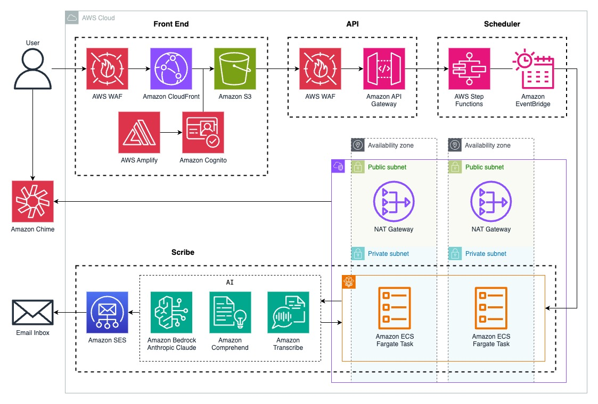

# Automated Meeting Scribe and Summarizer

Using this application's website, you can invite an AI-assisted scribe bot to your upcoming Amazon Chime meeting(s) to get a follow-up email with the attendee list, chat history, attachments, and transcript, as well as a summary and action items. You don't even need to be present in a meeting for your invited scribe bot to join. Each scribe bot is linked to your email for identification. The scribe bot also redacts sensitive personally identifiable information (PII) by default, with the option to redact additional PII. This security and privacy-focused application deploys into an individual AWS account with just a few clicks in the AWS CloudFormation console.

## Architecture

### Build Resources 
- The CloudFormation stack creates an AWS CodeBuild project that references the source code in this repository to build a Docker image that is pushed to Amazon Elastic Container Registry (ECR) and a React build directory that is uploaded to Amazon Simple Storage Service (S3). 
    - An AWS Lambda-backed custom resource runs a build of the CodeBuild project.

### Application Resources
- The static website is hosted in S3 and served using Amazon CloudFront. 
- Web authentication is provided by AWS Amplify Authentication, powered by Amazon Cognito.
- AWS Web Application Firewall (WAF) also protects the CloudFront distribution and Amazon API Gateway*.
- API Gateway invokes an AWS Step Functions synchronous express workflow that schedules an Amazon Elastic Container Service (ECS) task through Amazon EventBridge Scheduler. 
- The ECS application uses Selenium within Chrome to capture attendees, messages, and machine-generated captions from Amazon Chime's web application. Amazon Comprehend is then used to detect/redact PII before Anthropic's Claude 2.0 on Amazon Bedrock generates the summaries. The summary and action items, along with the other deliverables, are emailed using Amazon Simple Email Service (SES).

 \* This application uses the following AWS-managed WAF rules on each Web ACL: AWSManagedRulesAmazonIpReputationList, AWSManagedRulesCommonRuleSet, and AWSManagedRulesKnownBadInputsRuleSet. If you would like to add additional rules, you can do so in the [WAF console](https://us-east-1.console.aws.amazon.com/wafv2/homev2?region=us-east-1#/). 

## Getting Started

### Prerequisites
To interact with Claude 2.0 on Bedrock, you need to [request access to the model in US East (North Virginia)](https://console.aws.amazon.com/bedrock/home?#/modelaccess)*. Make sure to read and accept the end-user license agreements or EULA.

### Deployment
- Per [guidance for workload isolation on AWS](https://aws.amazon.com/solutions/guidance/workload-isolation-on-aws/), it is recommended that you deploy the CloudFormation template in its own AWS account.
- Download [scribe.yaml](scribe.yaml) or clone the entire repository with `git clone https://github.com/aws-samples/automated-meeting-scribe-and-summarizer.git`.
- Open the [CloudFormation console](https://us-east-1.console.aws.amazon.com/cloudformation/home?region=us-east-1#/stacks/create) to create a stack in US East (North Virginia)*.
- For **Template source**, select **Upload a template file**. Then, click **Choose file**. 
- Select **scribe.yaml** then click **Open**. 
- Once the S3 URL populates, click **Next**. 
- Enter a **Stack name** and **Email**.
    - This email address will be used to log in to the website as well as to send and receive email deliverables. 
- Click **Next** twice. 
- Click **I acknowledge that AWS CloudFormation might create IAM resources** then **Submit**. 

### Email Verification
- Open the inbox of the email you entered. You can expect to receive two emails:
    - Email Address Verification Request in region US East (N. Virginia)
        - Click the provided URL to authorize use of the email address.
    - Your temporary password
        - Use your username and temporary password to log in to the website.

### Accessing the Website
- Return to the CloudFormation console. 
- Once the stack shows *CREATE_COMPLETE* status, click **Outputs**. 
- Click on the CloudFront URL to open the website. 
- Enter your username and password. 
    - Change your password and verify your email as needed.

### Using the Website
- To invite a scribe bot to your upcoming meeting, simply enter the **Meeting ID**, **Meeting Name**, and **Meeting Time** then click **Submit**. 
- To delete an existing invite, select the invite then click **Delete**.
- To log out, click **Logout**.

### Using Amazon Chime
- At the specified meeting time, a scribe bot will join your meeting's waiting room. It will wait up to five minutes in the waiting room before exiting.
- Once admitted into the meeting, the scribe bot will introduce itself with a message in the chat.
- At any point, you can send the scribe bot(s) command messages in the chat to start capturing new messages and machine-generated captions, redact additional PII, and/or remove the scribe bot(s) from the meeting.

 \* The application stack will not deploy outside US East (North Virginia) because, to use an Amazon Certificate Manager (ACM) certificate with CloudFront, the certificate must be requested in that region. 

## Clean-up
- Open the [CloudFormation console](https://us-east-1.console.aws.amazon.com/cloudformation/home?region=us-east-1#/stacks).
- Select the stack you created then click **Delete** twice.

## Security
See the [CONTRIBUTING](CONTRIBUTING) file for more information.

## License
This repository is licensed under the MIT-0 License. See the [LICENSE](LICENSE) file.

## Contributors
- Kevin Pinkerton
- Lawton Pittenger
